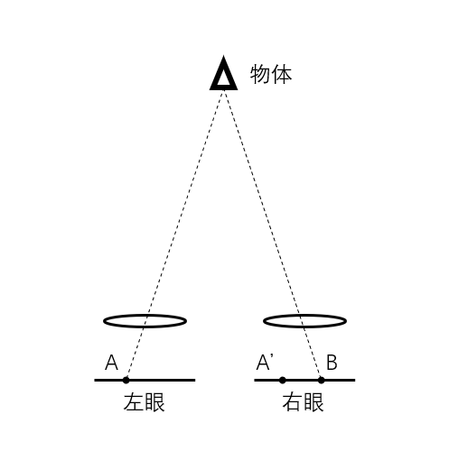

# 基于视差和运动矢量的立体视频舒适度研究

## 摘要

## abstract

## 目录

## 正文

1. ## 绪论

    传统平面视频技术目前已取得长足发展，从最初的CRT显示器全面过渡到了高分辨率、高刷新率和高色彩还原度的LCD显示器，人眼早已无法察觉显示面板的像素密度的进一步提升。而当传统平面显示技术的进步无法满足人们对更真实、更高还原度画面的追求，立体视频技术凭借其逼真的视觉体验和全新的交互体验，正逐渐成为人们的新宠，在教育、科研、军事、医疗、娱乐等众多领域得到越来越广泛的应用。但随着立体视频技术应用到越来越多领域，其舒适度问题也日益凸显出来。

    - ### 1.1 立体视频舒适度研究目的及意义

        立体显示技术早在上个世纪就已开始发展，人类史上第一部真正意义上的立体视频也早在1953年就已上映。但由于各种原因，这种具有全新视觉体验的视频形式却并没有很快在大众中流行开来。直到2009年，出自二十世纪福克斯之手的现象级3D科幻电影《阿凡达》的上映才使得立体视频技术为大众所熟知。但立体视频技术给人们带来身临其境的观影体验和交互体验的同时，也带来了各种舒适度问题。由于立体视频画面景深的持续变化，人眼不得不持续的进行辐辏调节。长时间观看立体视频时，眼球一直持续进行微小运动，因此很容易产生眼疲劳、头晕目眩等不适症状。拍摄立体视频的技术早已趋向成熟，但由于舒适度问题的存在，目前的商业电影除部分特大制作之外，很少采用3D技术进行摄制。除影院外，立体视频技术目前的另一应用场景是VR一体机设备，各种VR游戏也层出不穷。搭载加速度传感器实时监测头部运动后，可以在立体显示的基础上实现360度的沉浸式交互体验。但这类VR设备与其他采用立体视频技术的设备一样，也同样存在长时间佩戴后导致眼部不适的问题。
        
        在不远的将来，随着低延迟、高带宽的5G网络的发展，移动端的3D视频通话、3D实景直播、在线VR等对网络延时和带宽要求较高的特殊应用在技术上将逐渐变得可行，而立体视频的舒适度问题则会成为制约立体视频技术在这类日常使用场景中的广泛应用的主要原因。若能通过研究立体视频舒适度问题，定位导致视觉不适的根源，消除或减轻长时间观看立体视频所产生的视觉疲劳症状，提升人们的立体视频观影体验质量，立体视频技术一定能在5G时代结合VR、AR、MR等应用，在更多日常应用场景中大放光彩。

    - ### 1.2 立体视频舒适度的研究现状

        立体视频技术的起源和发展较早，其舒适度问题也早已为人们所发觉，因此国内外已经针对立体视频的舒适度问题进行了为全面且有价值的研究。
        
        目前的立体视频技术依赖于传统平面视频技术，显示面板的对比度、像素密度、分辨率、色彩还原度等参数会影响2D视频的观影质量，因此也会影响基于此的立体视频的体验质量。`法国GIPSA实验室的Raluca Vlad等人`的研究中关于画面质量对立体内容的感知质量的影响的结论表明，用于产生立体感的2D图像的质量对3D内容的体验质量有影响，高质量的2D图像是产生高质量3D内容的前提。在国内，`天津大学的刘畅等人`针对立体视频的对比度和舒适度的关系进行了大量的主观评价实验，证明左右眼的对比度不一致会导致立体视频观影过程的不适感，并最终确定了导致视觉不适的归一化对比度差异门限值为1.18，最小值为-2.04。

        除从传统视频继承的舒适度影响因素外，立体视频的观影舒适度同时也受到其他各种复杂因素的影响。在观看传统2D视频时，人眼内晶状体的焦距以及眼球的辐辏都是固定的，而在观看立体视频时，人眼的辐辏需要随时根据视频画面的景深进行调节。当左右画面不一致时，人眼无法调节到使左右眼画面相匹配的状态，这种情况会使人脑产生强烈的不适感。`法国波尔多大学的Jérémy Frey等人`通过研究受试者在观看立体视频的过程中脑电图的变化来找出人脑认为不适的视频帧，在视差发生变化的1秒内以74%的准确率识别到人脑的异常，由此确定了立体视频的视差与舒适度的相关性。除这种借助复杂手段进行的客观舒适度研究之外，也有许多其他基于主观评价测试的舒适度研究。国外相对较全面的有`西班牙马德里理工大学的Juan Pedro López等人的研究`，其基于立体视频帧的景深图和运动信息，针对一组立体视频内容进行了一系列主观评价测试，较为全面的分析了视频帧内的视差信息、帧间的运动信息以及二者的组合对观看者的舒适度影响，得出了一些常见的不适场景。较大负视差画面给观影者带来物体出屏的真实感的同时，也常常引起辐辏-调节冲突，超过舒适区的负视差是导致视觉不适的一个重要因素。实验表明画面同时存在运动和负视差时会导致舒适度较大程度的降低。此项研究同时也发现视频帧间的高速运动与观看者产生不适感之间的较高相关性。在国内，`西安电子科技大学的常波`通过软件合成一些具有不同视觉特征的非自然立体视频片段，有针对性的研究了立体视频舒适度与各个不同立体视频特性之间的关联，总结出了几个影响舒适度的关键因素。该研究的主观实验结果表明空域和时域上的视差变化均会导致舒适度下降，视差的变化幅值也会影响舒适度。除视差外，研究还注意到立体视频的前景物尺寸与主观实验得出的舒适度的正相关性，但这种相关性在前景物尺寸足够大时减弱。`吉林大学的姜秀红等`分两个研究路线分别建立了舒适度评价模型。第一条路线按照人眼注意区域将视差细分为了前景、背景、帧间三类视差，同时考虑视频画面的运动，用这四个因素构建了立体视频舒适度评价模型。第二条路线选择水平视差作为立体视频舒适度评价模型的一个主要因素，在此基础上加入视频画面本身的对比度信息作为模型的补偿因素，基于深度感知理论以及最小二乘拟合法建立了另一个舒适度评价模型。主观评价测试结果表明两种模型都具有一定的可行性。

        整体来看，目前国内外针对立体视频的舒适度研究已取得比较丰硕的进展，已确定的影响因素多种多样，在数据传输上主要有立体视频的非保真编码和有损传输等，在图像本身客观参数上主要有分辨率、亮度、对比度等，在3D内容特性上有景深变化范围、视差变化范围、辐辏-调节冲突、画面运动等多种因素。学术界对舒适度的研究已较为完善，但所提出的各种舒适度客观评价模型大多较为复杂，对计算性能的要求较高，在计算资源的消耗和计算结果的准确率之间不能很好的取舍。

    - ### 1.3 本课题主要研究内容

        本课题选取立体视频中的视差和运动矢量两个信息作为评估立体视频舒适度的主要因素，按照已有研究所证实的视差和运动矢量对舒适度的影响方式，通过统计学方法来计算立体视频的舒适度估计值。

        本文首先介绍立体视觉的形成原理，分析可能引起人眼不适的特征，引入视差和景深等概念，在此基础上论证视差和运动对立体视频观看舒适度的影响，证明选取这两个因素作为舒适度客观评价算法的主要指标的合理性。然后根据视差的特点和视差对舒适度的影响方式，对从视频帧中获取的视差信息进行统计学计算并通过计算结果判断画面视差的统计学特征是否符合已有研究所识别的引起不适的视差特征，并尝试进行视差调整，估计出视差重映射对舒适度的提升程度。在通过视差估计该帧画面的舒适度值的同时，将该帧与前一帧进行比较，计算出该帧相对上一帧的运动矢量，并分析该帧的运动信息在统计学上的特征是否符合已有研究所确定的导致舒适度降低的运动信息特征。结合视差和运动矢量信息，通过算法估计出每一帧的客观舒适度，在此基础上进一步估计整个立体视频序列的客观舒适度，并将计算结果与主观评价实验的结果进行比对，验证算法的准确性。
    

2. ## 立体视觉原理和不适源分析

    - ### 2.1 双目立体视觉的形成原理

        人眼可以感知物体的远近，这得益于人的双眼和大脑的密切合作。在视物时，人的左眼和右眼所看到的画面虽然大致相同，但在细节上存在很多差异，大脑会将这种差异识别成景深信息。在生理结构上，人眼的晶状体可以简化为一个焦距在一定范围内可变的光学镜片。虽然视网膜实际呈球面型，但在视物时，前景物会投影在视网膜中央的黄斑区，球面上的这一小块区域可以近似认为是一个平面。因此，可以将双眼近似的等效为如下所示的光学系统。

        

        在上图简化后的光学系统中，物体散射的光线经过晶状体汇聚后分别成像到左眼视网膜的A点和右眼视网膜的B点。当物体在足够远位置时，物体的成像点A和B都处于视网膜正中间，此时左眼成像点A所对应的右眼位置A'与右眼成像点B的位置重合，A'B的距离为0。当物体逐渐靠近时，其在左眼的成像点A逐渐左移，右眼成像点B则逐渐右移，A'B的长度逐渐增大。图中A'B的长度与物体的远近相关，物体越近，A'B长度越大，反之亦然。因此，大脑可以简单的通过对比左右眼所观察到的画面中对应点在两眼成像位置的差异大小来估计出物体到人眼的距离。实际上大脑获取物体景深信息的原理和过程更为复杂，但在研究立体视频所依赖的立体视觉形成原理时，可以简单的认为人脑所感知的物体远近只取决于物体在两眼间的成像位置差异，即只与上图中的A'B长度有关。

    
    - ### 2.2 立体视觉的不适源

3. ## 无参考立体视频舒适度评价算法

    - ### 3.1 算法考虑的舒适度影响因素

        - #### 3.1.1 立体视频帧画面内视差

        - #### 3.1.2 立体视频帧间运动矢量

    - ### 3.2 影响因素的提取
        
        - #### 3.2.1 画面内视差的提取
        
        - #### 3.2.2 运动矢量的提取

    - ### 3.3 基于统计学的客观舒适度估计

    - ### 3.4 针对视差的舒适度提升尝试
        

4. ## 舒适度主观评价实验

    - ### 4.1 实验器材和受试者

        - #### 4.1.1 立体眼镜选择

        - #### 4.1.2 立体视频片段选择

        - #### 4.1.3 受试者选择

    - ### 4.2 实验步骤

    - ### 4.3 实验结果分析

5. ## 总结与展望

## 参考文献

1. Raluca Vlad,Patricia Ladret,Anne Guérin. Three factors that influence the overall quality of the stereoscopic 3D content: image quality, comfort, and realism[P]. Electronic Imaging,2013.

2. 刘畅,李素梅.影响立体图像舒适度的对比度范围的测定[J].光电子.激光,2014,25(04):748-755.

3. Jérémy Frey, Aurélien Appriou, Fabien Lotte, Martin Hachet. Estimating Visual Comfort in Stereoscopic Displays Using Electroencephalography: A Proof-of-Concept[J].INTERACT,2015.

4. Rodrigo, J.A., Jimenez, D., Menendez, J.M.. Real-time 3-D HDTV depth cue conflict optimization[P]. Consumer Electronics - Berlin (ICCE-Berlin), 2011 IEEE International Conference,2011.

5. Juan Pedro López,Juan Antonio Rodrigo,David Jiménez,José Manuel Menéndez. Stereoscopic 3D video quality assessment based on depth maps and video motion[J]. EURASIP Journal on Image and Video Processing,2013.

6. 常波. 立体视频舒适度客观评价算法研究[D].西安电子科技大学,2014.

7. 姜秀红. 立体视频舒适度的研究[D].吉林大学,2016.

8. 姜秀红,王世刚,赵晓琳,鲁奉军,王晓燕.基于对比度补偿的立体视频舒适度评价[J].吉林大学学报(信息科学版),2016,34(02):192-195.

## 致谢

## 附录

