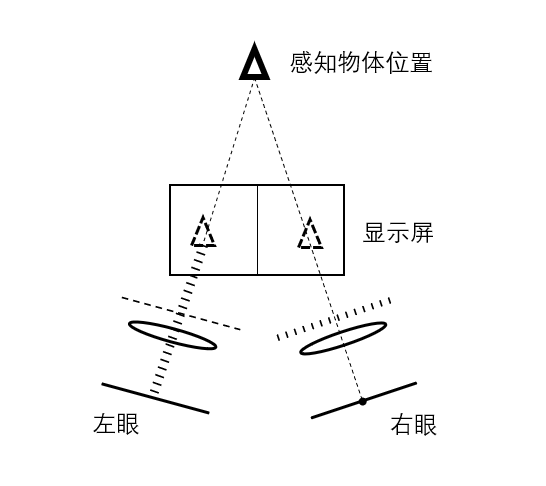
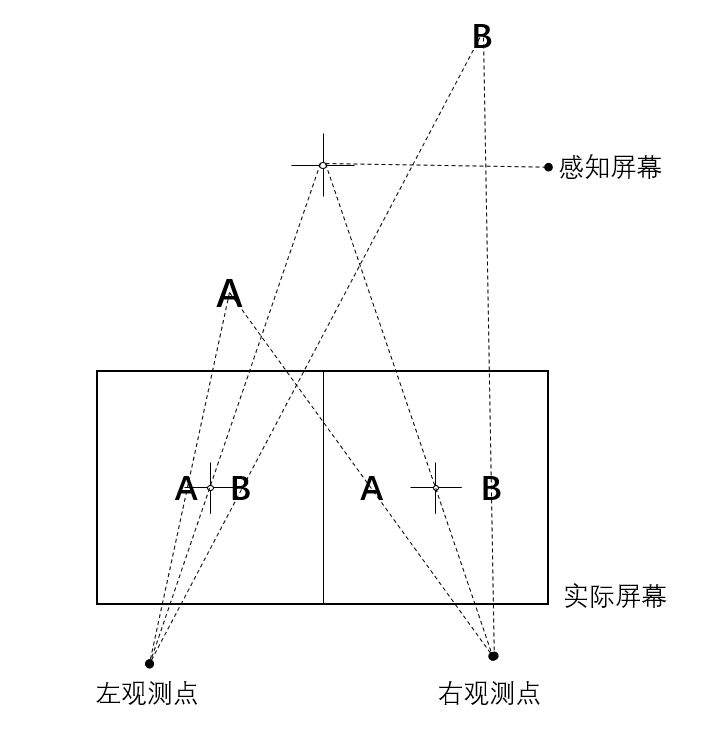
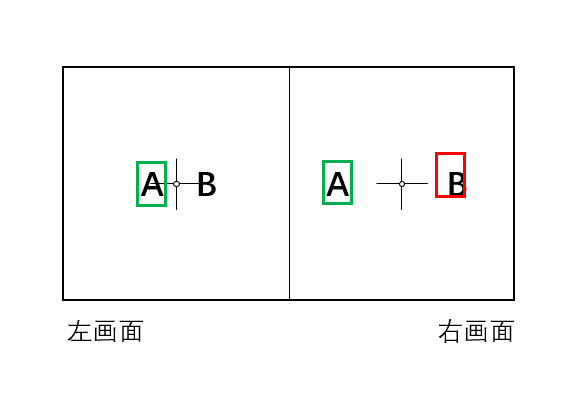

# 基于视差和运动矢量的立体视频舒适度研究

## 摘要

## abstract

## 目录

## 正文

1. ## 绪论

    传统平面视频技术目前已取得长足发展，从最初的CRT显示器全面过渡到了高分辨率、高刷新率和高色彩还原度的LCD显示器，人眼早已无法察觉显示面板的像素密度的进一步提升。而当传统平面显示技术的进步无法满足人们对更真实、更高还原度画面的追求，立体视频技术凭借其逼真的视觉体验和全新的交互体验，正逐渐成为人们的新宠，在教育、科研、军事、医疗、娱乐等众多领域得到越来越广泛的应用。但随着立体视频技术应用到越来越多领域，其舒适度问题也日益凸显出来。

    - ### 1.1 立体视频舒适度研究目的及意义

        立体显示技术早在上个世纪就已开始发展，人类史上第一部真正意义上的立体视频也早在1953年就已上映。但由于各种原因，这种具有全新视觉体验的视频形式却并没有很快在大众中流行开来。直到2009年，出自二十世纪福克斯之手的现象级3D科幻电影《阿凡达》的上映才使得立体视频技术为大众所熟知。但立体视频技术给人们带来身临其境的观影体验和交互体验的同时，也带来了各种舒适度问题。由于立体视频画面景深的持续变化，人眼不得不持续的进行辐辏调节以适应画面变化。长时间观看立体视频时，眼球一直持续进行微小运动，因此很容易产生眼疲劳、头晕目眩等不适症状。拍摄立体视频的技术早已趋向成熟，但由于舒适度问题的存在，目前的商业电影除部分特大制作之外，很少采用3D技术进行摄制。除影院外，立体视频技术目前的另一应用场景是VR一体机设备，各种VR游戏也层出不穷。搭载加速度传感器实时监测头部运动后，可以在立体显示的基础上实现360度的沉浸式交互体验。但这类VR设备与其他采用立体视频技术的设备一样，也同样存在长时间佩戴后导致眼部不适的问题。
        
        在不远的将来，随着低延迟、高带宽的5G网络的发展，移动端的3D视频通话、3D实景直播、在线VR等对网络延时和带宽要求较高的特殊应用在技术上将逐渐变得可行，而立体视频的舒适度问题则会成为制约立体视频技术在这类日常使用场景中的广泛应用的主要原因。若能通过研究立体视频舒适度问题，定位导致视觉不适的根源，消除或减轻长时间观看立体视频所产生的视觉疲劳症状，提升人们的立体视频观影体验质量，立体视频技术一定能在5G时代结合虚拟现实、增强现实或混合现实等应用，在更多日常应用场景中大放光彩。

    - ### 1.2 立体视频舒适度的研究现状

        立体视频技术的起源和发展较早，其舒适度问题也早已为人们所发觉，因此国内外已经针对立体视频的舒适度问题进行了为全面且有价值的研究。
        
        目前的立体视频技术依赖于传统平面视频技术，显示面板的对比度、像素密度、分辨率、色彩还原度等参数会影响2D视频的观影质量，因此也会影响基于此的立体视频的体验质量。`法国GIPSA实验室的Raluca Vlad等人`的研究中关于画面质量对立体内容的感知质量的影响的结论表明，用于产生立体感的2D图像的质量对3D内容的体验质量有影响，高质量的2D图像是产生高质量3D内容的前提。在国内，`天津大学的刘畅等人`针对立体视频的对比度和舒适度的关系进行了大量的主观评价实验，证明左右眼的对比度不一致会导致立体视频观影过程的不适感，并最终确定了导致视觉不适的归一化对比度差异门限值为1.18，最小值为-2.04。

        除从传统视频继承的舒适度影响因素外，立体视频的观影舒适度同时也受到其他各种复杂因素的影响。在观看传统2D视频时，人眼内晶状体的焦距以及眼球的辐辏都是固定的，而在观看立体视频时，人眼的辐辏需要随时根据视频画面的景深进行调节。当左右画面不一致时，人眼无法调节到使左右眼画面相匹配的状态，这种情况会使人脑产生强烈的不适感。`法国波尔多大学的Jérémy Frey等人`通过研究受试者在观看立体视频的过程中脑电图的变化来找出人脑认为不适的视频帧，在视差发生变化的1秒内以74%的准确率识别到人脑的异常，由此确定了立体视频的视差与舒适度的相关性。除这种借助复杂手段进行的客观舒适度研究之外，也有许多其他基于主观评价测试的舒适度研究。国外相对较全面的有`西班牙马德里理工大学的Juan Pedro López等人的研究`，其基于立体视频帧的景深图和运动信息，针对一组立体视频内容进行了一系列主观评价测试，较为全面的分析了视频帧内的视差信息、帧间的运动信息以及二者的组合对观看者的舒适度影响，得出了一些常见的不适场景。较大负视差画面给观影者带来物体出屏的真实感的同时，也常常引起辐辏-调节冲突，超过舒适区的负视差是导致视觉不适的一个重要因素。实验表明画面同时存在运动和负视差时会导致舒适度较大程度的降低。此项研究同时也发现视频帧间的高速运动与观看者产生不适感之间的较高相关性。在国内，`西安电子科技大学的常波`通过软件合成一些具有不同视觉特征的非自然立体视频片段，有针对性的研究了立体视频舒适度与各个不同立体视频特性之间的关联，总结出了几个影响舒适度的关键因素。该研究的主观实验结果表明空域和时域上的视差变化均会导致舒适度下降，视差的变化幅值也会影响舒适度。除视差外，研究还注意到立体视频的前景物尺寸与主观实验得出的舒适度的正相关性，但这种相关性在前景物尺寸足够大时减弱。`吉林大学的姜秀红等`分两个研究路线分别建立了舒适度评价模型。第一条路线按照人眼注意区域将视差细分为了前景、背景、帧间三类视差，同时考虑视频画面的运动，用这四个因素构建了立体视频舒适度评价模型。第二条路线选择水平视差作为立体视频舒适度评价模型的一个主要因素，在此基础上加入视频画面本身的对比度信息作为模型的补偿因素，基于深度感知理论以及最小二乘拟合法建立了另一个舒适度评价模型。主观评价测试结果表明两种模型都具有一定的可行性。

        整体来看，目前国内外针对立体视频的舒适度研究已取得比较丰硕的进展，已确定许多对立体视频舒适度有影响的特征。在实用性方面，基于这些已确定的舒适度影响因素，各项研究已能够对立体视频的创建、后期处理、传输直到观看的过程给出提高立体视频舒适度的实用性意见。虽然学术界对舒适度的研究已较为完善，但所提出的各种舒适度客观评价模型为了追求计算结果的准确性，大多需要参考多个舒适度影响因素，模型较为复杂，对计算性能的要求较高，在计算资源的消耗和计算结果的准确率之间不能很好的取舍。

    - ### 1.3 本课题主要研究内容

        本课题选取立体视频中的视差和运动矢量两个信息作为评估立体视频舒适度的主要因素，按照已有研究所证实的视差和运动矢量对舒适度的影响方式，通过统计学方法来计算立体视频的舒适度估计值。

        本文首先介绍立体视觉的形成原理，分析可能引起人眼不适的特征，引入视差和景深等概念，在此基础上论证视差和运动对立体视频观看舒适度的影响，证明选取这两个因素作为舒适度客观评价算法的主要指标的合理性。然后根据视差的特点和视差对舒适度的影响方式，对从视频帧中获取的视差信息进行统计学计算并通过计算结果判断画面视差的统计学特征是否符合已有研究所识别的引起不适的视差特征，并尝试进行视差调整，估计出视差重映射对舒适度的提升程度。在通过视差估计该帧画面的舒适度值的同时，将该帧与前一帧进行比较，计算出该帧相对上一帧的运动矢量，并分析该帧的运动信息在统计学上的特征是否符合已有研究所确定的导致舒适度降低的运动信息特征。结合视差和运动矢量信息，通过算法估计出每一帧的客观舒适度，在此基础上进一步估计整个立体视频序列的客观舒适度，并将计算结果与主观评价实验的结果进行比对，验证算法的准确性。
    

2. ## 立体视觉原理和不适源分析

    - ### 2.1 双目立体视觉的形成原理

        人眼可以感知物体的远近，这得益于人的双眼和大脑的密切合作。在视物时，人的左眼和右眼所看到的画面虽然大致相同，但在细节上存在很多差异，大脑会将这种差异识别成景深信息。在生理结构上，人眼的晶状体可以简化为一个焦距在一定范围内可变的光学镜片。虽然视网膜实际呈球面型，但在视物时，前景物会投影在视网膜中央的黄斑区，球面上的这一小块区域可以近似认为是一个平面。因此，可以将双眼近似的等效为如下所示的光学系统。

        

        在上图简化后的光学系统中，物体散射的光线经过晶状体汇聚后分别成像到左眼视网膜的A点和右眼视网膜的B点。当物体在足够远位置时，物体的成像点A和B都处于视网膜正中间，此时左眼成像点A所对应的右眼位置A'与右眼成像点B的位置重合，A'B的距离为0。当物体逐渐靠近时，其在左眼的成像点A逐渐左移，右眼成像点B则逐渐右移，A'B的长度逐渐增大。图中A'B的长度与物体的远近相关，物体越近，A'B长度越大，反之亦然。因此，大脑可以简单的通过对比左右眼所观察到的画面中对应点在两眼成像位置的差异大小来估计出物体到人眼的距离。实际上大脑获取物体景深信息的原理和过程相当复杂，但在研究立体视频所依赖的立体视觉形成原理时，可以简单的认为人脑所感知的物体远近只取决于物体在两眼间的成像位置差异，即只与上图中的A'B的长度有关。因此，立体视觉本质上是由于同一物体在左右眼视网膜上的成像位置的差异所导致的。这种差异越大，人脑感知到的物体位置越近。
    
    - ### 2.2 立体视觉的不适源
        
        基于上述立体视觉形成的基本原理，针对左右眼展示从不同位置拍摄的同一画面，便可“欺骗”大脑产生立体感。这种方式虽然能够在左右眼画面上较好的模拟人眼的真实视物体验，但其他方面仍存在一些与实际视物体验不一致的地方。
        
        以左右3D格式的立体视频为例，如下图所示，在观看某一帧左右3D格式的画面时，借助于偏振式眼镜，显示屏的左半边画面和右半边画面分别只成像于左眼和右眼视网膜。人脑能从左右眼差异中感知到画面所表达的物体的位置，并转动眼球调整视轴使其交汇于人脑感知的物体位置。但为了在视网膜上投影出清晰的画面，晶状体必须聚焦于屏幕上。此时晶状体聚焦的点被调节在显示屏上，视轴却会聚到了显示屏之后。而在实际视物时，人眼的晶状体聚焦的点和视轴汇聚的点是一致的。

        

        观看立体视频时，这种晶状体和眼球视轴的调节不一致被称为辐辏-调节冲突。根据`Shibata等人的研究`，一定范围内的辐辏-调节冲突并不会导致明显不适，这个范围被称为舒适区（ZoC）。在观看距离为0.3米（一般移动设备的建议观看距离）时，舒适区定义下的视轴汇聚点距离约为0.2到0.6米，在观看距离为3米（一般电视的建议观看距离）时，视轴汇聚点的舒适区距离约为1.2米到无穷大。超过舒适区的辐辏-调节冲突被认为会导致不适。

        当人脑所感知到的物体位置越近，眼球所要转动的角度越大，眼球越容易疲劳。当视差为正，即某物体在右半画面中的相对位置比在左画面中的相对位置靠右时，物体的感知位置较远，人脑认为物体沉入屏幕内。反之，视差为负时，感知位置较近，人脑认为物体浮于屏幕外。较大的负视差会使辐辏-调节冲突落在舒适区之外，导致舒适度的降低。

        当左右眼画面差异较大时，例如左眼画面与右眼画面完全不相关，或左右眼画面存在垂直视差，此时无论如何调节眼球，人脑都无法对左右眼画面进行匹配，此时会产生强烈的不适感。

3. ## 无参考立体视频舒适度评价算法

    本章介绍一种基于统计学的无参考立体视频舒适度评价算法。算法主要考虑立体视频的视差和运动矢量信息，利用统计学方法总结出视频帧内的视差分布规律和帧间的运动规律，通过视差和运动矢量的统计学特征来以较低的时间复杂度得出该视频帧大体上的舒适度估计值，在短时间内对视频序列整体上的观看体验给出客观评价。算法在对每一帧进行舒适度估计值解算的同时，若某帧的视差特征被识别为可能导致不适，算法尝试对其进行视差调节并计算通过视差重映射所能提高的舒适度值。

    - ### 3.1 算法考虑的舒适度影响因素

        现有研究已确定的影响立体视频舒适度的因素多种多样，在数据传输上主要有立体视频的非保真编码和有损传输等，在图像本身客观参数上主要有分辨率、亮度、对比度等，在3D内容特性上有景深变化范围、视差变化范围、辐辏-调节冲突、画面运动等各种因素。在用于快速估计立体视频舒适度的计算模型中，显然不可能考虑所有影响因素。当前多数关于立体视频舒适度的研究认为视差是与立体视频舒适度相关性最强的一个因素，多数舒适度评价模型也都考虑了视差对舒适度的影响。本文为保证舒适度最终估计值的准确性，考虑到特征提取算法的计算资源消耗，在视差的基础上，选择较为容易通过计算获取的帧间运动矢量信息作为视差对舒适度影响的补充。下面分两个小结分别对选取视差和运动矢量作为舒适度主要影响因素的合理性和正确性进行论述。

        - #### 3.1.1 立体视频帧画面内视差

            根据双目立体视觉的形成原理，左右眼的视差是携带景深信息的载体，是产生立体感的根源。同时，研究也指出视差是导致不适感的一大源头。在立体视觉中，视差是指以左眼和右眼作为不同观测点观看同一物体时，物体在左右眼视野中的位置的差异。观测点离物体越近，或两个观测点之间的距离越远，这种差异就越大。由于人的左右眼距离恒定，同一物体在左右眼视野中的位置差异就只取决于物体的距离。在观看立体视频时，人眼感知视差来源于视频帧画面中的对应像素点的距离。如下图所示，人脑感知的立体视频画面中心在实际屏幕后方，由于屏幕中文字A在右画面中的相对位置比其在左画面中的相对位置偏左，人脑感知的文字A的位置在屏幕前，人脑认为文字A的位置较近，这种感觉可描述为“出屏感”。文字A所具有的这种视差称为负视差。文字B的情况相反，右画面中文字B的位置相对偏右，具有正视差，感知到的距离较远，这种感觉称为“入屏感”。

            

            通过理论分析可以知道，存在较大负视差的画面具有较强的出屏感，使人脑感知的物体距离过近，控制眼球转动的肌肉需要持续紧张以使眼球转动较大的角度，使视轴汇聚到该物体，因而负视差过大理论上会导致眼疲劳。

            除负视差外，视差影响舒适度的另一个特征是视差的变化范围。若画面中物体的视差各不相同且分布较为离散，人眼的聚焦点较难从一个感知深度较近的物体立刻转移到另一个感知深度较远的物体，此时也容易产生不适。

        - #### 3.1.2 立体视频帧间运动矢量

            若单独选取立体视频帧内的视差作为舒适度评价算法的参考因素，所估计出的舒适度都只针对某一特定帧，这种方法用于评估立体静态图的舒适度较为合理，但不适用于立体视频的舒适度评估。从本质上讲，立体视频虽也是由一帧一帧的静态图组成的，但立体视频的舒适度并不只取决于组成视频的所有视频帧的舒适度，视频帧的运动同样会对立体视频的舒适度产生影响。立体视频画面中物体位置的运动会引起眼球的运动，若视频画面内的物体一直保持运动，眼球同样必须一直进行辐辏调节，使物体通过眼球晶状体所成的像落在视网膜的黄斑区以得到物体清晰的画面。因而若立体视频帧间存在较大的运动，会导致眼球同样产生较大的辐辏调节运动，导致舒适度降低。

            立体视频的帧间运动矢量并不完全独立的影响视频的舒适度。前述`西班牙马德里理工大学的Juan Pedro López等人的研究`表明，视差和运动虽都能独立的影响立体视频的舒适度主观评价实验结果，但二者的在影响立体视频舒适度时存在一定的“协同关系”，即视差和运动对舒适度的影响分别均为1时，二者同时出现后对立体视频舒适度的影响却有“1+1＞2”的效果，即二者会在原来的基础上加强各自对舒适度的影响。研究认为当某视频画面内某物体的视差为负，且同时该物体在该帧的位置相对其在上一帧的位置存在运动时，会导致较为明显的舒适度降低。具有正视差的物体由于感知距离较远，其位置变化在人眼看来并不明显，因而其运动并不会引起较大的辐辏调节。而具有负视差的物体本身会使眼球的辐辏调节角度过大，当其存在运动时，即使是较小的运动，也会引起眼球视轴较大的转动，因而相比正视差和运动的组合，负视差与运动的组合更容易引起明显的舒适度降低。
            
    - ### 3.2 影响因素的提取
        
        - #### 3.2.1 画面内视差的提取

            立体视频帧内的视差是指对应像素点在左右画面中的相对位置的差异程度。对立体视频帧内视差的提取本质上是对左右画面内像素点的匹配。双目立体视觉的匹配算法多种多样，也各有其优缺点。应用较为广泛的有总绝对差值算法（SAD算法）和半全局块匹配算法（SGBM算法）。SAD算法的核心思路是针对左画面的每一个像素块，在右画面中寻找差异最小的像素块。块内像素点差异的绝对值之和越小，算法就认为两个块的匹配程度越高。如下图所示，当算法在视频帧的左画面执行块匹配到文字“A”处时，在右画面中扫描到文字“A”出现的块时，左右像素块的相似度最高，差异最小，因而其总绝对差值近似为0。而右画面中其他任意位置的像素块均与左画面的像素块存在一定差异，两个像素块之间的SAD大于0。可以简单认为总绝对差值最小的两个像素块对应视野内的同一空间位置。这种算法实现简单，时间复杂度较低，匹配结果的准确性也在可接受范围内，因而在一些准确性要求较低的场景下应用较为广泛。

            

            由于舒适度的准确估计依赖于视差信息的准确获取，因而SAD算法虽然在双目立体视觉匹配上的速度较快，但准确性难以满足要求。本文的舒适度评价算法采用openCV所实现的SGBM算法来获取立体视频帧的景深图。SGBM算法主要参考了`德国航空航天中心的Heiko Hirschmüller的研究成果`，基于互信息和全局平滑约束的近似来执行双目视觉的像素点匹配。这种算法的时间复杂度相比SAD算法要高，但实际测试表明其匹配结果比SAD算法更准确，且运行时间也在可接受的范围内。
        
        - #### 3.2.2 运动矢量的提取

            立体视频所携带的运动信息是其与立体静态图像的根本不同之处，在立体视频的每一帧静态图像的基础上评价立体视频的舒适度，就必须考虑视频帧间所包含的运动信息。视频的运动矢量的提取也有多种方法，由于对立体视频的舒适度估计需要考虑的视频运动信息只涉及到判断画面是否存在引起不适的较大运动，因而对运动信息提取的准确性要求不高。本文采用openCV中的光流场法来计算视频的帧间运动信息。openCV中的稠密光流算法实现参考了`瑞典林雪平大学计算机视觉实验室的Gunner Farneback`所提出的基于多项式展开的两帧运动估计算法。实测该算法可以在较短时间内对视频两帧之间的运动信息进行较为准确的提取。

    - ### 3.3 基于统计学的客观舒适度估计

        在借助openCV完成了对立体视频帧内视差的准确提取和帧间运动信息的大致提取后，便可基于这两个信息对该立体视频序列进行客观舒适度估计了。通过对已有立体视频舒适度的研究的学习，本文决定

    - ### 3.4 针对视差的舒适度提升尝试
        

4. ## 舒适度主观评价实验

    - ### 4.1 实验器材和受试者

        - #### 4.1.1 立体眼镜选择

        - #### 4.1.2 立体视频片段选择

        - #### 4.1.3 受试者选择

    - ### 4.2 实验步骤

    - ### 4.3 实验结果分析

5. ## 总结与展望

## 参考文献

1. Raluca Vlad,Patricia Ladret,Anne Guérin. Three factors that influence the overall quality of the stereoscopic 3D content: image quality, comfort, and realism[P]. Electronic Imaging,2013.

2. 刘畅,李素梅.影响立体图像舒适度的对比度范围的测定[J].光电子.激光,2014,25(04):748-755.

3. Jérémy Frey, Aurélien Appriou, Fabien Lotte, Martin Hachet. Estimating Visual Comfort in Stereoscopic Displays Using Electroencephalography: A Proof-of-Concept[J].INTERACT,2015.

4. Rodrigo, J.A., Jimenez, D., Menendez, J.M.. Real-time 3-D HDTV depth cue conflict optimization[P]. Consumer Electronics - Berlin (ICCE-Berlin), 2011 IEEE International Conference,2011.

5. Juan Pedro López,Juan Antonio Rodrigo,David Jiménez,José Manuel Menéndez. Stereoscopic 3D video quality assessment based on depth maps and video motion[J]. EURASIP Journal on Image and Video Processing,2013.

6. 常波. 立体视频舒适度客观评价算法研究[D].西安电子科技大学,2014.

7. 姜秀红. 立体视频舒适度的研究[D].吉林大学,2016.

8. 姜秀红,王世刚,赵晓琳,鲁奉军,王晓燕.基于对比度补偿的立体视频舒适度评价[J].吉林大学学报(信息科学版),2016,34(02):192-195.

9. Shibata Takashi,Kim Joohwan,Hoffman David M,Banks Martin S. The zone of comfort: Predicting visual discomfort with stereo displays.[J]. Journal of Vision,2011,11(8).

10. Hirschmuller, H.. Accurate and efficient stereo processing by semi-global matching and mutual information[P]. Computer Vision and Pattern Recognition, 2005. CVPR 2005. IEEE Computer Society Conference,2005.

## 致谢

## 附录

